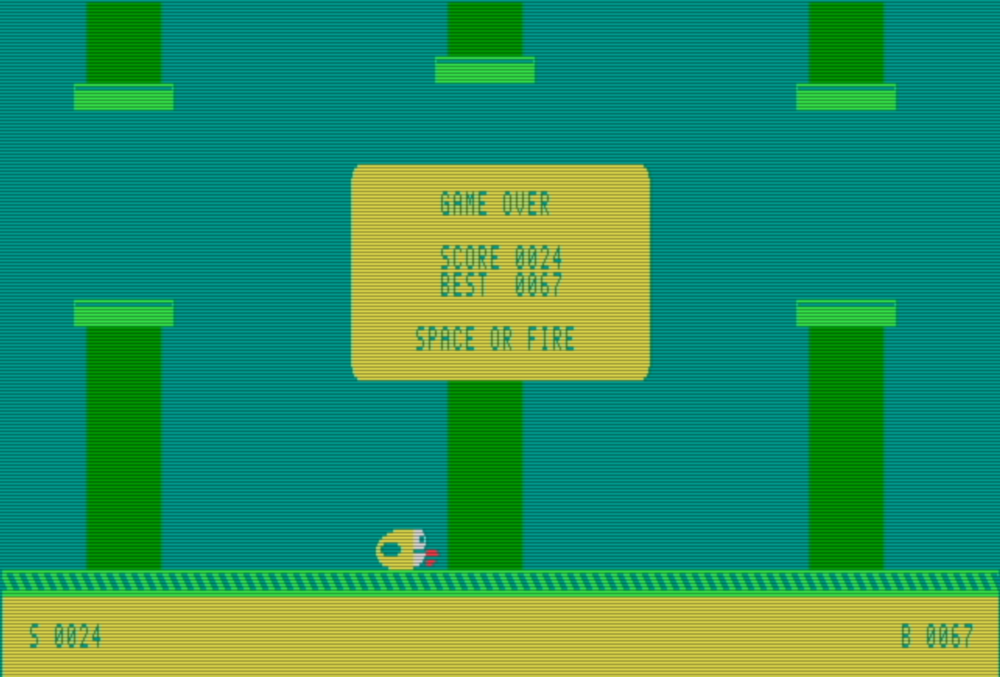

# Flappy80

A Flappy Bird style game for the Commodore 128, written in C with Oscar64.
The entire game uses **80 × 25 VDC character mode**, including the bird,
pipes, lettering and ground. No bitmap mode or VIC-II sprites are used.



## Play

Add path to Oscar64 in Makefile

```sh
make
make run
```

A prebuilt [`build/flappy.prg`](build/flappy.prg) is included in the
repository, so you can play without building.

Load `build/flappy.prg` on a C128 with an 80-column RGBI display. From BASIC 7,
use `LOAD"FLAPPY.PRG",8,1` followed by `RUN` (with the file on your disk).
This version requires a **64 KB VDC**, such as the C128 DCR configuration in
VICE.

- **Space** or **joystick port 2 fire**: start / flap / retry.
- **P**: pause or resume.
- **Q**: quit to BASIC.

Release and press again for each flap. Fly through the gaps without touching
the pipes or ground. Touching the top of the screen stops upward movement
without ending the run. Each passed pipe earns one point; score and best are
shown in the dirt at the bottom. The pipes start at an average of 3 pixels
per displayed frame and speed up every 10 points, reaching 3.6 pixels per
frame at 20 points (`SPEED_START`, `SPEED_MAX` and `SPEEDUP` in
`src/flappy.c`). Scrolling uses two-pixel font phases, so these are average
speeds rather than a three-pixel step on every frame. Hitting a pipe flashes the sky and the bird
falls to the ground before the game-over panel appears. The best score is
retained across retries until you quit. A short delay after a crash prevents
an accidental restart.

`make lab` builds `build/birdlab.prg`: the same game with the pipes parked
off screen, for working on the bird.

## Look

Styled after the original Flappy Bird. Within the VDC's one foreground colour
per 8 × 8 cell over a shared background:

- Dark cyan sky across the whole screen, which is also the border colour.
- The bird is 40 × 12 VDC pixels, drawn across 5 × 3 cells: yellow body, white face and
  eye, red lips, and a wing cut out in sky colour. On a 4:3 monitor it is
  wider than tall, like the original. Edit it in `tools/bird_art.py`, which
  generates `src/bird_art.h` (`python3 tools/bird_art.py`) and can render a
  preview (`python3 tools/bird_art.py preview.png`).
- Ground: a light green grass strip with diagonal stripes that scroll with
  the pipes, over pale yellow dirt (`DIRT_COLOUR`).
- Title, pause and game over use a rounded yellow panel with sky-coloured
  lettering cut out of solid glyphs, covering whole cells.

## Implementation

The 80NG Pong project provided the Oscar64 build, VDC timing/setup/restore
pattern, SID driver and VICE monitor harness. The flight physics, pipe
course, art, game state logic and frame pacing are new.

- 2 MHz CPU with direct CIA keyboard/joystick scanning. `keys()` is kept out
  of line because the test harness patches it.
- Six simulation ticks per five displayed frames preserve the original
  fixed-point gravity, flap impulse and jump height while increasing the
  pace by 20%. Input is scanned once per displayed frame, so holding fire
  cannot retrigger a flap on the occasional two-tick frame. Collision is
  checked on each simulation tick; only the final state is displayed.
  Wing animation, restart delay and SID gate/pitch-sweep timers use the
  same faster clock. Rendering and VDC refresh timing are unchanged.
- Fixed-point gravity and flap impulses. Four recycled pipes, 29 columns
  apart, with seven-row gaps at pseudorandom heights. Horizontal collision
  bounds include the current two-pixel phase. The scroll speed is kept in
  eighths of a phase per simulation tick. At the top speed, a two-tick frame
  advances at most three phases (six pixels), crossing at most one cell
  boundary.
- Four font banks provide two-pixel pipe phases, and the same banks scroll
  the grass stripes. Character cells change only when a pipe crosses a
  character boundary.
- Two screen pages: `$0000`/`$0800` and `$1000`/`$1800` (screen/attributes).
  During play, each pipe's next column position is drawn on the hidden page
  ahead of the step, using VDC block copies of the displayed strip rows moved
  one cell left. At a character boundary, the screen and attribute page
  registers are written during the last active frame and the font bank in the
  following vertical blank, so all three take effect on the same frame whether
  the VDC takes the page addresses at the start of blank (as a real C128
  appears to) or of the next frame (as VICE does). Between boundaries only the
  font bank changes, and the bird and score are written to the displayed page.
  Only pipe steps flip pages: title, pause, falling and game-over screens
  write their changed cells to the displayed page in the blank. The hidden
  page is then stale until play resumes; every way back into play redraws the
  field, and the next blank copies the whole displayed page (both planes) to
  the hidden one with block copies.
- Bird poses (3 wing positions × 8 pixel offsets) live in VDC RAM at `$9000`,
  each laid out as 15 font slots. The bird uses one of two 15-glyph sets,
  loaded by one block copy into the font bank about to be shown (each bank
  remembers the pose it holds); when the bird changes row the other set is
  loaded first and the cells switch to it. A pose change alone writes no
  screen cells, and in the same row `bird_draw()` skips its cell updates.
- SID: each effect owns a voice so they never cut each other off — voice 1
  flap (and the crash thud), voice 2 the two-note point chime, voice 3 the
  falling crash sweep. The flap is a low noise swell with a 24 ms attack
  (`FLAP_AD`/`FLAP_SR` in `src/sound.c`); a zero attack made it sound like a
  hit. `PITCH()` scales effect frequencies and pitch steps by 6/5. The crash
  thud sets its own sharp envelope on the shared voice.
- VDC accesses are much cheaper in the vertical blank. Measured in VICE in
  the game's display mode: a register or data write takes about 13 µs in the
  blank and about 52 µs during the display (a 64-write run: 654 versus 3,369
  µs). So the frame is split: `prepare_frame()` is CPU work on the shadow
  only, and `show_frame()`, in the blank, writes the font bank,
  loads the bird pose, writes changed cells to the displayed page, and then
  prerenders every visible pipe not yet drawn ahead. Doing them all right
  after a step leaves the blanks before the next step free, so a step frame
  has the whole frame for its own work; a prerender that runs past the blank
  only writes the hidden page. The step frame's `stage_frame()` writes the
  few hidden-page cells that changed since the last flip, then flips.
- The pipe prerender copies body rows in two runs and the caps with their
  attributes. A copy leaves the VDC's update and source addresses just past
  what it copied, so the next row only rewrites the high bytes that change
  (usually 3 register writes instead of 5). A pipe entering on the right
  copies one cell less and writes its own edge tile straight after, with no
  address change. In VICE a pipe takes about 1.5 ms (it was 4.6 ms).
- Changed cells are written screen bytes first, then attributes, so
  neighbouring cells stream through the VDC's auto-increment. Frames with
  nothing stale on the displayed page skip the scan. After a pipe step, bird
  cells are rewritten only in rows the prerender copied (outside the pipe's
  gap, caps included).
- Frame pacing: CIA #2 timer A free-runs as a stopwatch. If a frame's work
  runs into the next blank and more than 10 ms have passed since the last
  show, `wait_frame()` returns at once and the frame is shown in what is
  left of that blank, instead of waiting a whole frame more. A flip frame
  never does this: it waits out the blank before selecting the page.
- Quit restores the original font at `$2000`, VDC timing/display registers, CIA
  port and timer configuration, VIC display and CPU speed, and silences all
  SID voices. The VDC registers are restored counting down: Oscar64 1.32
  `-O2` has been seen to compile that counting-up loop to enter with its
  index register unset.

Oscar64 is taken from PATH (the Makefile also falls back to a local
development path). Override it with `make OSCAR64=/path/to/oscar64`. Two Oscar64 `-O2`
miscompiles have been worked around (an 8-bit rotate expression, now a lookup
table; and a nested loop that lost its exit when its column tests became
constant). After changing constants, check that the PRG size is sensible and
that `build/flappy.lbl` still lists `keys`.

## VDC memory requirement

**The renderer requires 64 KB VDC RAM.** This is separate from the C128's
main CPU RAM.

| VDC allocation | Address range | Bytes written |
| --- | --- | ---: |
| Character screen | `$0000–$07CF` | 2,000 |
| Colour attributes | `$0800–$0FCF` | 2,000 |
| Second screen page | `$1000–$17CF` | 2,000 |
| Second attribute page | `$1800–$1FCF` | 2,000 |
| Pipe phase 0 font | `$2000–$2EFF` | 3,840 |
| Pipe phase 1 font | `$4000–$4EFF` | 3,840 |
| Pipe phase 2 font | `$6000–$6EFF` | 3,840 |
| Pipe phase 3 font | `$8000–$8EFF` | 3,840 |
| Bird pose library | `$9000–$A67F` | 5,760 |
| **Total initialized storage** | | **29,120 (28.44 KiB)** |

Each font bank stores 240 glyphs in 16-byte slots, with eight visible rows
and eight padding bytes per glyph. This layout cannot fit in 16 KB. CPU-side
screen shadows and the saved original font are not counted in this table.

Measured in VICE, reading font bytes through the VDC data port rather than
relying on monitor backing-memory reads:

| Physical VDC RAM setting | Incorrect font bytes out of 192 sampled | Result |
| --- | ---: | --- |
| 64 KB | 0 | All four sampled font banks retained (rechecked 2026-10-02) |
| 16 KB | 100 | Font data corrupted by insufficient RAM/address aliasing (rechecked 2026-10-02) |

The diagnostic samples a phase-dependent pipe edge plus HUD digits, lettering
and panel glyphs in each bank. This is a sample verification, not an
exhaustive RAM test. A 16 KB edition would require a different font
layout/update strategy.

## Verification

```sh
make test

# Reproduce the VDC memory comparison:
python3 -B tests/vice_flappy.py --memory-only --ram 64
python3 -B tests/vice_flappy.py --memory-only --ram 16

# Per-phase CPU clocks during active play:
python3 -B tests/vice_flappy.py --profile 400 --profile-flight

# VDC CPU-write versus block-copy timing (run on real hardware):
make bench
```

Requires Python 3 and `x128` (VICE), with local monitor socket access.
`make test` runs the PRG on PAL/64 KB and NTSC/64 KB configurations. It checks
character mode, VDC screen/attribute uploads on the displayed page, a
pipe/bird pixel model over 500 updates (bird glyphs are read back from the
displayed font bank and compared with `tools/bird_art.py`), start/flap/pause,
the six-ticks-in-five-frames flight curve, starting scroll displacement over
20 frames, SID flap gating and both point
chime pitches, scoring, pipe recycling, crash/fall/death/retry, 300 frames
at maximum speed skimming just above the lower caps (bird cells sharing the
prerendered cap rows), a pipe
landing during a character-boundary step, then game over and a restart
leaving both pages clean (the hidden one after the restart's page copy) and
the next steps pixel-exact, non-lethal ceiling clamping, the free-fall and
game-over cadence, and font/register/speed restoration.

Results on 2026-10-02 (VICE, 64 KB VDC, 3-pixel starting-speed trial):

| Configuration | Displayed updates/sec | Simulation ticks/sec | Free fall and game over | Checks |
| --- | ---: | ---: | ---: | --- |
| PAL | 59.71 | 71.65 | 57.91 fps | All pass |
| NTSC | 59.69 | 71.63 | 57.86 fps | All pass |

The VDC refreshes at about 59.63 Hz with this timing. The faster simulation
keeps displayed updates close to that rate in the 500-frame autopilot check;
the 300-frame maximum-speed cap-skimming check also passes. Before the pace
change, this renderer measured 59.62 PAL and 59.61 NTSC displayed updates/sec.
Active cadence is calculated from emulated CIA timer clocks and measures
completed game/display loops, not the VDC's display refresh rate. Simulation
cadence is 6/5 of that rate. The test's per-frame intervals are
sampled at `keys()`, after the blank work, so a step frame (whose blank does
the prerendering) reads long and the frame after it short; their sum is two
refreshes.

VICE times VDC block copies during active display about three times faster
than a real C128 (`bench/vdcbench.c`: 255 bytes take 1501 µs on hardware
versus 462 µs in VICE; in vertical blank both take about 380 µs). The game has
been played extensively on a real C128, including the bird, full-screen
layout, panels and three-voice sound; the latest VDC write speed-ups
(streamed cell writes and narrower bird rewrites) and the 120% pace/pitch
tuning have been checked in VICE alone. Control tests inject the
key-scanner result. Audio checks inspect SID registers; they do not assess
the sound by ear. Screenshots and emulator logs are saved in `build/`.
